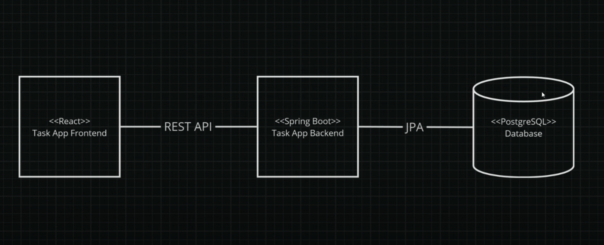
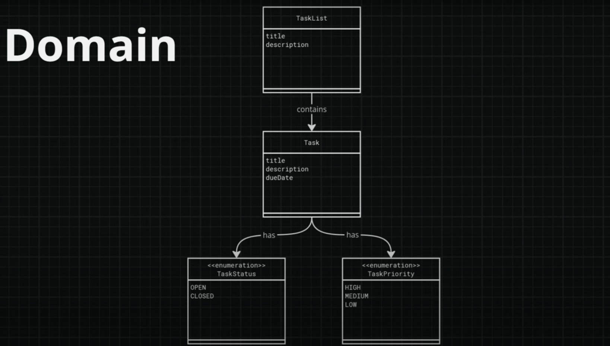
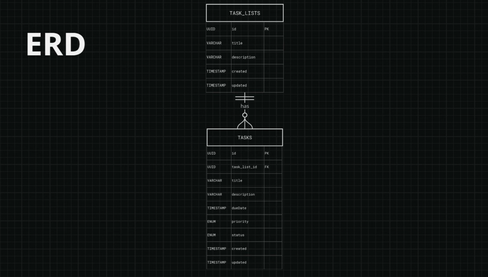
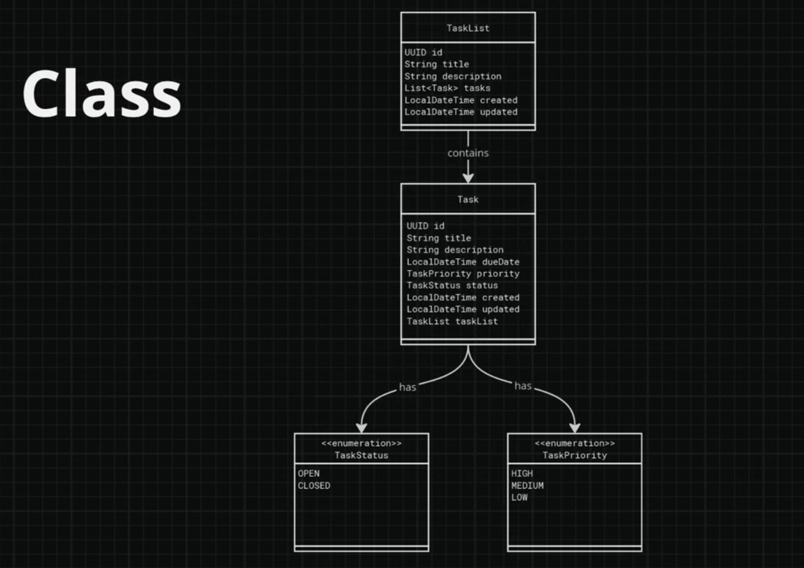

# Molon Planner 🗓️

A sophisticated task management system with nested task lists and priority-based organization, built with modern web technologies.

## Features ✨

- **Hierarchical Task Management** - Organize tasks in nested lists
- **Priority System** - HIGH/MEDIUM/LOW priority levels
- **Status Tracking** - OPEN/CLOSED status indicators
- **RESTful API** - Fully documented endpoints
- **Audit Trail** - Automatic created/updated timestamps

## Technology Stack 🛠️

| Layer        | Technologies                         |
| ------------ | ------------------------------------ |
| **Backend**  | Spring Boot 3, JPA/Hibernate, Lombok |
| **Database** | PostgreSQL, Flyway Migrations        |
| **DevOps**   | Maven, Git, Postman                  |

## API Documentation 📚

### TaskLists Resource

| Method | Endpoint                     | Description            |
| ------ | ---------------------------- | ---------------------- |
| GET    | `/task-lists`                | List all task lists    |
| POST   | `/task-lists`                | Create new task list   |
| GET    | `/task-lists/{task_list_id}` | Get specific task list |
| PUT    | `/task-lists/{task_list_id}` | Update task list       |
| DELETE | `/task-lists/{task_list_id}` | Delete task list       |

### Tasks Resource

| Method | Endpoint                                     | Description        |
| ------ | -------------------------------------------- | ------------------ |
| GET    | `/task-lists/{task_list_id}/tasks`           | List tasks in list |
| POST   | `/task-lists/{task_list_id}/tasks`           | Create new task    |
| GET    | `/task-lists/{task_list_id}/tasks/{task_id}` | Get specific task  |
| PUT    | `/task-lists/{task_list_id}/tasks/{task_id}` | Update task        |
| DELETE | `/task-lists/{task_list_id}/tasks/{task_id}` | Delete task        |

---

## System Design 🏗️

### Architecture

---

### Domain Model

**Key Entities**:

- **TaskList**: Container for grouped tasks
  - Manages collection of related tasks
  - Contains metadata (title, description)
- **Task**: Individual actionable item
  - Implements priority/status system
  - Supports temporal tracking
- **Enums**:
  - `TaskPriority`: HIGH, MEDIUM, LOW
  - `TaskStatus`: OPEN, CLOSED

---

### Database Schema

**Relationships**:

- 🔗 **One-to-Many**:
  - `TaskList` ➔ `Tasks` (Cascade operations)
- 📝 **Audit Fields**:
  - Automatic `created`/`updated` timestamps
- 🔐 **Identifiers**:
  - UUID v4 primary keys
  - Foreign key constraints

---

### Class Diagram

**Core Components**:

- **JPA Entities**:
  - Lombok `@Data` annotations
  - Hibernate validation constraints
- **Enum Management**:
  - Type-safe status/priority handling
  - Database enum type mapping
- **Relationships**:
  - Bi-directional `@OneToMany` mapping
  - Ownership via `TaskList` → `Task`
  - Fetch strategies for performance
